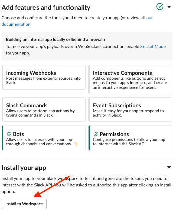
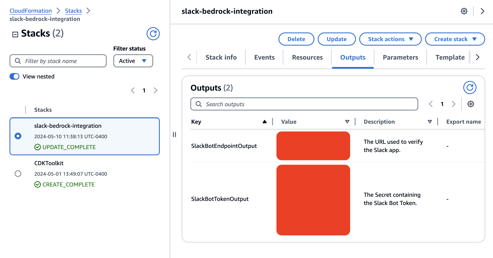
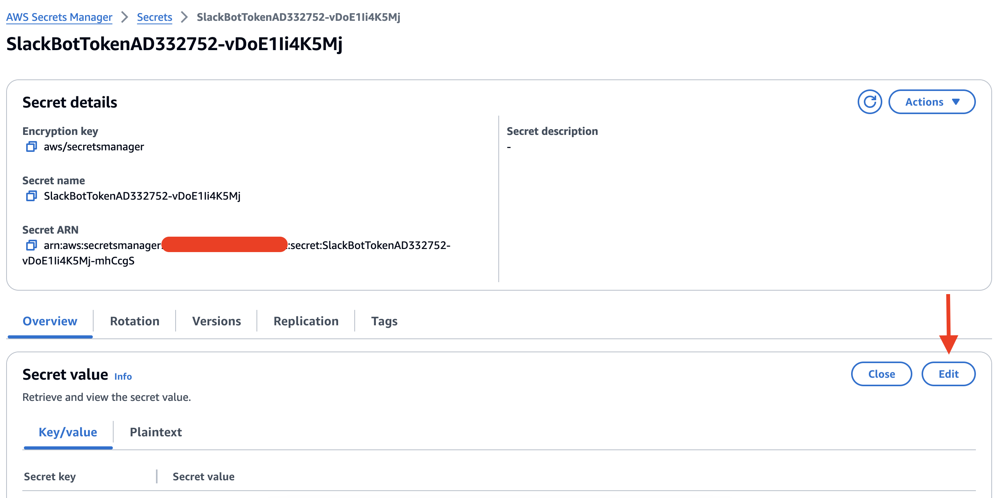

이 예제는 [Amazon Bedrock Slack Gateway](https://github.com/aws-samples/amazon-bedrock-slack-gateway/tree/main) 리포지토리의 한글 번역본이며 제공된 번역과 원본 영어의 내용이 상충하는 경우에는 영어 버전이 우선합니다. 또한 원문에서 Knowledge base for Amazon Bedrock과 Confluence 연동을 위한 6번 과정(Option)을 추가하였습니다.

# Slack Gateway for Amazon Bedrock

이 저장소에서는 Amazon Bedrock의 생성형 AI를 사용하여 Slack 채널 멤버들이 조직의 데이터와 지식 소스에 대화형 질의응답을 통해 접근할 수 있게 하는 프로젝트를 공유합니다. 데이터 소스 커넥터를 통해 조직 데이터에 연결하고 이를 Slack Gateway for Amazon Bedrock과 통합하여 Slack 채널 멤버들의 접근을 가능하게 할 수 있습니다. 이를 통해 사용자는 다음과 같은 작업을 수행할 수 있습니다:

* Slack Direct Message(DM)를 통해 Amazon Bedrock과 대화하며 회사 데이터를 기반으로 질문하고 답변을 얻거나, 이메일 같은 새로운 콘텐츠 생성에 도움을 받고, 작업을 수행할 수 있습니다.
* 또한 팀 채널에 참여하도록 초대할 수도 있습니다.
  * 채널에서 사용자는 새 메시지로 질문을 하거나 스레드의 어느 시점에서든 태그를 달 수 있습니다. 추가 데이터 포인트를 제공하거나, 토론을 해결하거나, 대화를 요약하고 다음 단계를 캡처하도록 할 수 있습니다.

자체 AWS 계정에 쉽게 배포하고 자체 Slack 워크스페이스에 추가할 수 있습니다. 아래에서 방법을 확인해보시길 바랍니다.

### 기능
- DM에서는 모든 메시지에 응답합니다
- 채널에서는 @mentions에만 응답합니다
- 대화 맥락을 인식합니다 - 대화를 추적하고 맥락을 적용합니다
- 여러 사용자를 인식합니다 - 스레드에서 태그되면 누가 무엇을, 언제 말했는지 알고 있어 맥락에 맞게 정확하게 기여하고 요청 시 스레드를 요약할 수 있습니다.

이 샘플 Amazon Bedrock Slack 애플리케이션은 오픈 소스로 제공됩니다. 

## 아키텍처


1. 사용자가 Slack 애플리케이션과 통신합니다.
2. Slack 애플리케이션이 이벤트 구독에 사용되는 Amazon API Gateway로 이벤트를 보냅니다.
3. Amazon API Gateway가 Lambda 함수로 이벤트를 전달합니다.
4. Lambda 함수가 요청과 함께 Amazon Bedrock을 호출한 다음 Slack에서 사용자에게 응답합니다.

## 솔루션 배포하기

### 사전 조건

AWS 계정과 이 애플리케이션에 필요한 리소스와 구성 요소를 생성하고 관리할 수 있는 권한이 있는 IAM Role/User가 필요합니다. AWS 계정이 없는 경우 [새 Amazon Web Services 계정을 어떻게 생성하고 활성화합니까?]((https://aws.amazon.com/premiumsupport/knowledge-center/create-and-activate-aws-account/))*를 참조하세요.

### 1. Slack App 만들기

https://api.slack.com/apps 에서 Slack 앱을 생성합니다. [app manifest](./slack-app-manifest.yaml)의 내용을 YAML로 복사/붙여넣기 하세요.

앱이 생성되면 앱을 설치하세요.



### 2. Amazon Bedrock Model Access 활성화

사용 가능한 목록에서 원하는 모델을 선택할 수 있습니다. [Amazon Bedrock 모델 액세스](https://docs.aws.amazon.com/bedrock/latest/userguide/model-access.html)에 대한 자세한 내용은 문서를 참조하세요.


### 3. 스택 배포하기

스택을 배포할 계정에 대한 임시 액세스 키를 받습니다. (액세스 키를 GitHub 저장소 또는 외부 저장소에 노출해서는 안됩니다.)

```
export AWS_ACCESS_KEY_ID="..."
export AWS_SECRET_ACCESS_KEY="..."
```

스택의 이름을 변경하고 싶다면 환경 변수를 설정하세요.

```
export STACK_NAME="my-stack-name"
```

이제 이 프로젝트의 종속성을 설치하고, 계정을 부트스트랩하고, 스택을 계정에 배포하세요.

```
npm ci
npx cdk bootstrap
npx projen deploy
```

### 4. Slack Token으로 Secret 업데이트하기

Slack Bot Token이 필요하며 이를 사용할 것입니다. 이 토큰을 복사하여 임의로 저장합니다.


CloudFormation 스택 상태가 CREATE_COMPLETE가 되면 **Outputs** 탭을 선택하고 SlackBotTokenOutput에서 URL을 클릭하세요.



Secret Manager에서 Secret Value에 접근하고 기록해놓은 Slack Bot Token으로 업데이트하세요.




### 5. Slack 애플리케이션 구성하기

다시 **Outputs** 탭으로 이동하여 SlackBotEndpointOutput에서 URL을 복사하고 Slack으로 돌아가 Event Subscriptions에 추가합니다.

Event Subscriptions으로 이동하여 Enable Events를 활성화합니다.


Event Subscriptions가 자동으로 확인되어야 합니다.


아래로 스크롤하여 Subscribe to bot events를 선택하고 app_mention과 message.im을 선택합니다. 그리고 변경 사항을 저장합니다.


### 인사하기

이제 생성된 슬랙봇에게 인사할 시간입니다!

1. Slack으로 이동하세요
2. Apps > Manage에서 새로운 Amazon Bedrock 앱을 추가하세요
3. 선택적으로 팀 채널에 앱을 추가하세요
4. 앱 DM 채널에서 Hello라고 말하세요. 팀 채널에서는 @mention으로 도움을 요청하세요.

### (Option) 6. Confluence 연동하기
Knowledge base for Amazon Bedrock은 S3, Confluence, Web Crawler 등 [다양한 데이터 소스](https://docs.aws.amazon.com/bedrock/latest/userguide/data-source-connectors.html)를 지원합니다. 자세한 내용은 [confluence README.md](./confluence/README.md) 파일을 참고하시기 바랍니다.


## Security

자세한 내용은 [보안 문제 알림](CONTRIBUTING.md#security-issue-notifications)을 참조하세요.

## License

This library is licensed under the MIT-0 License. See the [LICENSE](./LICENSE) file.
