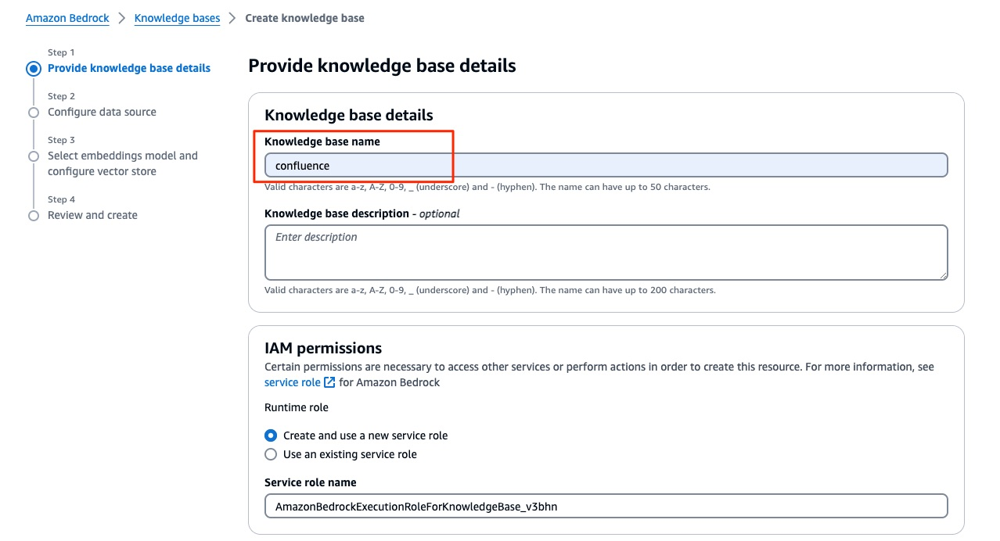
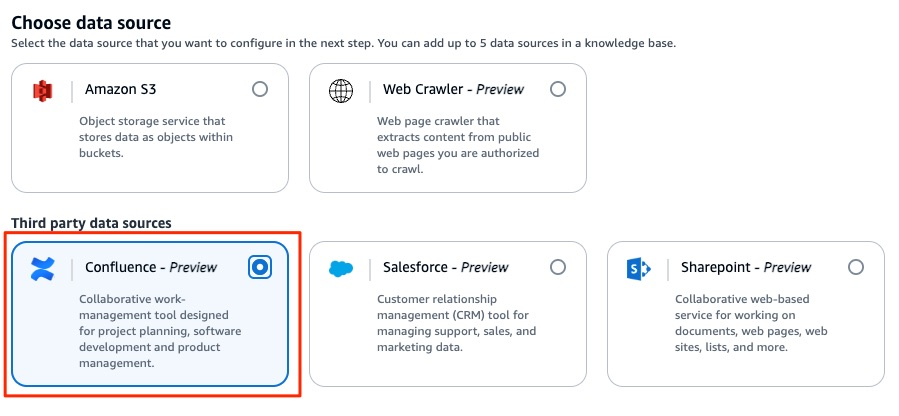
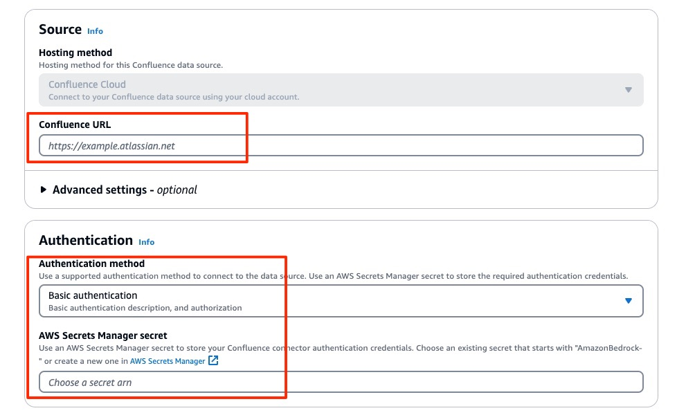
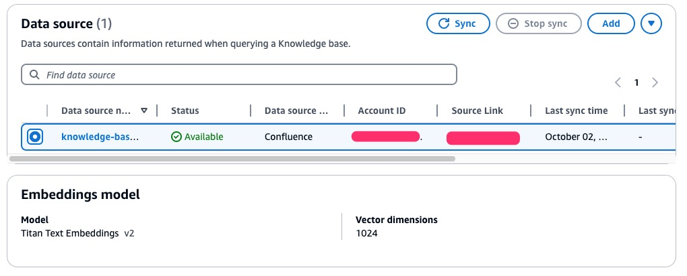
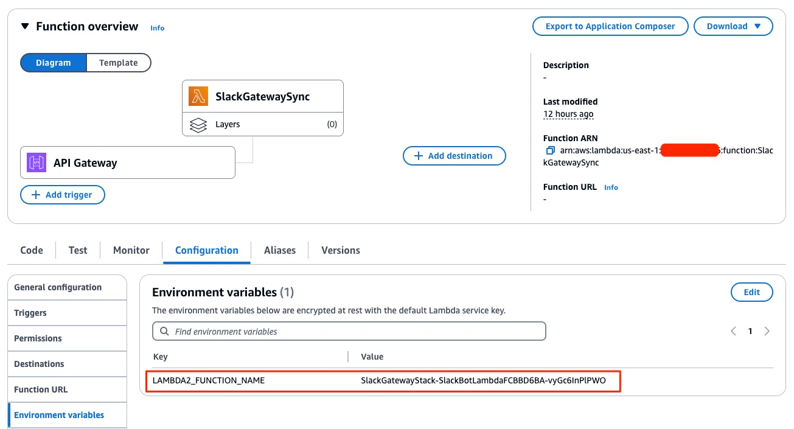
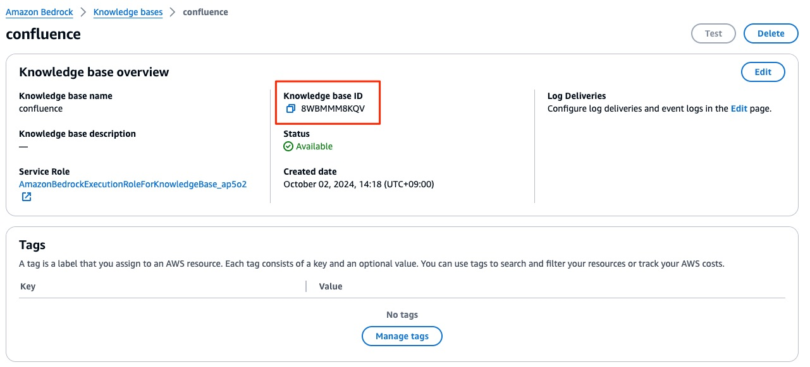
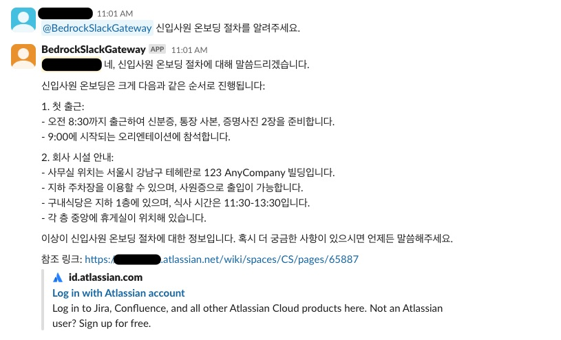

## Knowledge base for Amazon Bedrock과 Confluence 연동하기
이번 예제에서는 Confluence에 저장된 회사 규정 및 미팅 로그, 온보딩 문서를 **신규 입사자**가 간편하게 질의할 수 있는 슬랙 봇을 구현합니다.

### 사전 조건
Amazon Slack Gateway의 ["인사하기"](../README.md#인사하기)까지 진행합니다. 또한 Confluence 계정이 필요하며 [Confluence API Token](https://support.atlassian.com/atlassian-account/docs/manage-api-tokens-for-your-atlassian-account/)을 활용합니다. 

### 1. Confluence API Token 발급하기
먼저 Confluence 계정의 API Token을 발급하기 위해 Attlasian Account의 Security에 접근합니다. 
  - https://id.atlassian.com/manage-profile/security/api-tokens

Create API Token을 선택하여 Token 값을 잠시 메모합니다. 이 값은 추후 Knowledge Base와 Confluence 연결 시 [AWS Secret Manager](https://docs.aws.amazon.com/ko_kr/secretsmanager/latest/userguide/intro.html)의 Value로 사용됩니다.


### 2. Knowledge base for Amazon Bedrock 구성하기
Amazon Bedrock은 [Knowledge Base(KB)](https://aws.amazon.com/ko/blogs/korea/knowledge-bases-now-delivers-fully-managed-rag-experience-in-amazon-bedrock/) 기능을 통해 회사 데이터를 안전하게 연결하여 클릭 몇 번으로 Retrieval Augmented Generation(RAG)를 구성할 수 있습니다.

우선, KB를 생성하기 위해 Amazon Bedrock 콘솔에서 Builder tools > Knwoledge bases로 접근합니다. 그리고 Create Knowledge Base를 선택합니다.


Knowledge Base 이름을 자유롭게 입력합니다.


데이터 소스로 Confluence를 선택합니다. 이후 다른 설정은 기본값으로 놓고 Next를 선택합니다.


다음으로 Confluence URL 및 인증을 위한 AWS Secret Manager arn을 입력해야 합니다.


Knowledge Base for Amazon Bedrock의 데이터 소스로 Confluence에 연결하려면 **Base Authentication**과 OAuth 2.0 Authentication 중에서 선택할 수 있습니다. 이번 예제에서는 username(Confluence 사용자 계정 이메일 주소)과 password(Confluence API Token)를 사용해보겠습니다.

먼저 Confluence URL은 Attlasian Account > Product Settings에서 확인할 수 있습니다.
- https://id.atlassian.com/manage-profile/products


이제 AWS Secrets Manager에 관련 자격 증명을 저장하고 비밀번호를 추가해야 합니다. 참고 사항으로, Secret 이름은 "AmazonBedrock-"으로 시작하고 Knowledge base에 대한 IAM Service Role에 Secrets Manager에서 이 비밀번호에 액세스할 수 있는 권한이 있는지 확인해야 합니다.

예시에서는 Secret 이름을 **AmazonBedrock-confluence-kb** 로 지정했습니다. username에는 사용자 이메일을 password에는 Confluence API Token을 입력합니다. 그리고 **Secret Arn**을 복사하여 Knowledge Base 생성 화면의 AWS Secret Manager secret에 붙여 넣습니다.


다음으로 Bedrock Embedding Model을 선택합니다. Amazon Titan Embedding Model이 지원하는 언어에 대해서는 문서를 [참고](https://docs.aws.amazon.com/ko_kr/bedrock/latest/userguide/titan-embedding-models.html)하세요.


Vector database를 새로 생성할 경우, [Amazon OpenSearch Serverless Collection](https://docs.aws.amazon.com/ko_kr/opensearch-service/latest/developerguide/serverless-vector-search.html)이 생성됩니다. 지원되는 Vector Database 목록은 [문서](https://docs.aws.amazon.com/ko_kr/bedrock/latest/userguide/knowledge-base-setup.html)를 참고하세요.

여기까지 Knowledge Base for Amazon Bedrock과 Confluence를 연결했습니다.

### 3. Confluence 문서 임베딩
이제 Confluence의 회사 문서를 임베딩하여 벡터화된 값을 OpenSearch Serverless에 저장합니다. 본 예제에서는 Confluence에 휴가 안내, 퇴사 프로세스, 신입 사원 온보딩 문서가 있습니다. 이를 OpenSearch에 저장하는 방법은 생성된 Knowledge Base의 **Sync** 버튼을 클릭합니다.



Sync가 완료되면 아래와 같이 Status가 Completed로 표시됩니다.


여기까지 Knowledge Base for Amazon Bedrock과 Confluence 연동을 마쳤습니다.

### 4. Lambda 함수 업데이트
기존 Lambda를 수정하고 새로운 Lambda 한 개를 생성합니다. 

기존에 생성했던 API Gateway는 **HTTP API**이며 Lambda를 동기 호출하는 형태입니다. [Slack Event API](https://api.slack.com/apis/events-api#responding)는 3초 이내 2XX 응답이 오지 않을 경우 실패로 처리하여 자동으로 재시도 처리합니다. 현재 Knowledge Base를 쿼리하고 프롬프트를 전달받는 과정에서 문서양에 따라 3초 이상의 시간이 걸릴 수 있기 때문에, 요청을 받는 즉시 Slack으로 200 응답을 보내는 새 Lambda와 기존 Lambda를 비동기 호출하기 위한 코드 일부를 수정해야 합니다. Amazon API Gateway API에서 Lambda 함수를 비동기식으로 호출하는 방법은 [문서](https://repost.aws/ko/knowledge-center/api-gateway-invoke-lambda)를 참고하세요.

- 새로운 Lambda 함수 추가
    - 요청을 받는 즉시 Slack에 200 응답을 제공하는 [Lambda](../confluence/lambda/call-slack.py)를 생성합니다.
        - Runtime: Python 3.12
    - 새로운 Lambda가 기존 Lambda를 호출할 수 있도록 IAM Role에 invokeFunction을 추가합니다.
        ```json
            "Effect": "Allow",
            "Action": "lambda:InvokeFunction",
            "Resource": "arn:aws:lambda:us-east-1:012345678901:*"
        ```
    - Lambda 환경 변수에 LAMBDA2_FUNCTION_NAME을 추가합니다. Value는 기존 Lambda 함수의 이름입니다.
    
    - **API Gateway는 기존 Lambda 함수에 트리거되어 있습니다. 기존 트리거를 제거하고 새로 만든 Lambda에 연결하세요.**
    
- 기존 Lambda 코드 변경
    - 앞서 배포했던 Lambda 함수를 [해당 코드로 변경](../confluence/lambda/index.py)합니다. Knowledge Base를 검색(Retrieve)하고 검색 결과를 Amazon Bedrock Claude Haiku 모델에 전달하여 Slack으로 최종 응답을 받는 형태입니다.
    - <KNOWLEDGE_BASE_ID>를 이전에 생성했던 Knowledge Base Id로 변경합니다.
    
    - Lambda에서 Amazon Bedrock에 Retrieve 요청을 보내기 위해 IAM Role에 아래 내용을 추가합니다.
        ```json
            {
                "Action": [
                    "bedrock:Retrieve"
                ],
                "Resource": "*",
                "Effect": "Allow"
            }
        ```

여기까지 Lambda 함수를 생성 및 변경하고 API Gateway Trigger를 변경했습니다.

### 5. Slack 채널에서 테스트
Slack 채널에서 BedrockSlackGateway를 멘션하고 신입사원의 온보딩 과정에 대해 질의해봅니다.


참조 링크로부터 관련 내용을 확인할 수 있습니다.